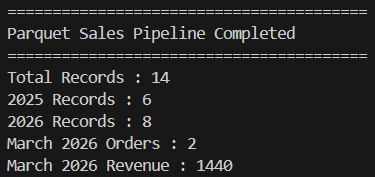

# PySpark Parquet Data Pipeline

## Project Overview

A local PySpark ETL (Extract, Transform, Load) data processing pipeline optimized for high-performance analytics by migrating raw transactional CSV data to an optimized, binary columnar Parquet storage format. The pipeline performs date normalization, derives temporal partition attributes (`year` and `month`), calculates total order spend, enforces data validation filters, and exports clean records into a partitioned Parquet directory. It further demonstrates Parquet re-ingestion, schema preservation, partition pruning, and targeted revenue aggregation.

---

## Technologies

- Python 3.14
- Apache Spark 4.2
- PySpark 4.2

---

## Features

- **Columnar Parquet Storage:** Converts text-based CSV source data into compressed, binary, column-oriented Parquet storage for efficient analytical processing.
- **Schema & Metadata Preservation:** Stores the DataFrame schema and native data types in Parquet metadata, allowing Spark to restore the schema when the dataset is read again.
- **Temporal Partitioning:** Writes output using `.partitionBy("year", "month")`, creating Hive-style `year=YYYY/month=MM/` directory structures.
- **Validation Filtering:** Enforces domain rules (`quantity > 0`, `unit_price > 0`, and non-null dates) before persisting records.
- **Partition Pruning:** Applies `year` and `month` predicates when querying the partitioned dataset, allowing Spark to avoid scanning irrelevant partitions.
- **Targeted Revenue Analytics:** Calculates revenue metrics for specific time periods and compares yearly record volumes.

---

## Project Structure

```text
18-pyspark-parquet-data-pipeline/
├── data/
│   └── orders.csv
├── output/
│   └── parquet_orders/
│       ├── year=2025/
│       └── year=2026/
├── screenshots/
│   ├── output1.png
│   ├── output2.png
│   ├── output3.png
│   ├── output4.png
│   ├── output5.png
│   └── output6.png
├── src/
│   └── main.py
├── .gitignore
├── LICENSE
├── README.md
└── requirements.txt
```

---

## ETL Process

- **Extract**

Initializes a local SparkSession using `local[*]` execution.
Ingests raw source transactions from data/orders.csv.

- **Transform**

Date Standardisation: Converts order_date string values to native DateType.
Temporal Feature Engineering: Extracts year and month fields from order_date.
Spend Calculation: Derives total_amount using quantity * unit_price.
Data Quality Filtering: Removes invalid entries where quantities/prices are non-positive or dates are missing.

- **Load**

Exports validated records to output/parquet_orders/ partitioned by year and month using .parquet().

- **Partition Querying & Analytics**

Reads the partitioned Parquet dataset back into Spark using spark.read.parquet().
Inspects automatic schema restoration from Parquet metadata.
Filters for March 2026 records and aggregates total revenue for that specific time window.

---

## Sample Output



---

## What I Learned

- Understanding the advantages of columnar Parquet storage compared with text-based CSV files.

- Implementing Hive-style partitioned storage using `.partitionBy()`.

- Reading Parquet datasets with `spark.read.parquet()` and understanding schema preservation.

- Using partition pruning to reduce unnecessary data scanning during analytical queries.

- Understanding the difference between logical DataFrame transformations and physical storage layout.

--- 

## Future Improvements

- Compression Codec Tuning: Benchmark Snappy vs. ZSTD compression algorithms for storage size and read speed optimization.

- Delta Lake Upgrade: Transition from raw Parquet files to Delta Lake format to support ACID transactions, time travel, and schema enforcement.

- File Size Optimization: Use .repartition() or .coalesce() to avoid the "small file problem" when saving partitioned output.

- Cloud Storage Integration: Configure directory destinations to target AWS S3 or Azure Blob Storage endpoints.

---

## Skills Demonstrated

- Data Storage Optimization: Parquet Format Conversion, Binary Storage Management, Schema Retention.

- PySpark File Operations: .parquet(), spark.read.parquet(), .partitionBy().

- Data Lake Engineering: Partition Pruning, Dynamic Directory Hierarchies, Temporal Analytics Aggregation.